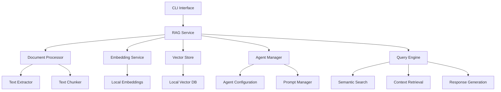

# Design Document

## Overview

The Local RAG System is a comprehensive solution that enables users to create specialized AI agents powered by custom knowledge bases extracted from various document formats. The system operates entirely offline using local embedding models and vector databases, ensuring data privacy and independence from external services. It integrates seamlessly with the existing Convergio CLI architecture and provides a foundation for domain-specific AI assistance.

## Architecture

The system follows a modular architecture with clear separation of concerns:



## Components and Interfaces

### 1. Document Processing Layer

#### TextExtractor
```typescript
interface ITextExtractor {
  extractText(filePath: string, format: DocumentFormat): Promise<ExtractedContent>;
  getSupportedFormats(): DocumentFormat[];
}

interface ExtractedContent {
  text: string;
  metadata: DocumentMetadata;
  pageCount?: number;
  wordCount: number;
}

enum DocumentFormat {
  PDF = 'pdf',
  TXT = 'txt',
  MD = 'md',
  DOCX = 'docx'
}
```

#### TextChunker
```typescript
interface ITextChunker {
  chunkText(content: ExtractedContent, options: ChunkingOptions): Promise<TextChunk[]>;
}

interface ChunkingOptions {
  chunkSize: number;
  chunkOverlap: number;
  strategy: ChunkingStrategy;
  preserveStructure: boolean;
}

interface TextChunk {
  id: string;
  content: string;
  metadata: ChunkMetadata;
  startIndex: number;
  endIndex: number;
}
```

### 2. Embedding Service Layer

#### LocalEmbeddingService
```typescript
interface IEmbeddingService {
  initialize(): Promise<void>;
  embedText(text: string): Promise<number[]>;
  embedBatch(texts: string[]): Promise<number[][]>;
  getDimensions(): number;
  getModelInfo(): EmbeddingModelInfo;
}

interface EmbeddingModelInfo {
  name: string;
  dimensions: number;
  maxTokens: number;
  language: string;
}
```

### 3. Vector Storage Layer

#### LocalVectorStore
```typescript
interface IVectorStore {
  initialize(config: VectorStoreConfig): Promise<void>;
  addDocuments(chunks: TextChunk[], embeddings: number[][]): Promise<void>;
  similaritySearch(queryEmbedding: number[], k: number, filter?: SearchFilter): Promise<SearchResult[]>;
  deleteDocuments(documentIds: string[]): Promise<void>;
  updateDocument(chunkId: string, chunk: TextChunk, embedding: number[]): Promise<void>;
  getStats(): Promise<VectorStoreStats>;
}

interface SearchResult {
  chunk: TextChunk;
  score: number;
  distance: number;
}

interface VectorStoreConfig {
  storePath: string;
  dimensions: number;
  indexType: IndexType;
  distanceMetric: DistanceMetric;
}
```

### 4. Agent Management Layer

#### AgentManager
```typescript
interface IAgentManager {
  createAgent(config: AgentConfig): Promise<RAGAgent>;
  getAgent(agentId: string): Promise<RAGAgent | null>;
  listAgents(): Promise<AgentSummary[]>;
  updateAgent(agentId: string, updates: Partial<AgentConfig>): Promise<void>;
  deleteAgent(agentId: string): Promise<void>;
}

interface AgentConfig {
  id: string;
  name: string;
  description: string;
  systemPrompt: string;
  personality: AgentPersonality;
  knowledgeBases: string[];
  settings: AgentSettings;
}

interface RAGAgent {
  id: string;
  config: AgentConfig;
  query(question: string, options?: QueryOptions): Promise<AgentResponse>;
  addKnowledgeBase(kbId: string): Promise<void>;
  removeKnowledgeBase(kbId: string): Promise<void>;
}
```

### 5. Query Processing Layer

#### QueryEngine
```typescript
interface IQueryEngine {
  processQuery(query: string, agent: RAGAgent, options?: QueryOptions): Promise<AgentResponse>;
}

interface QueryOptions {
  maxResults: number;
  minSimilarity: number;
  includeMetadata: boolean;
  contextWindow: number;
}

interface AgentResponse {
  answer: string;
  sources: SourceReference[];
  confidence: number;
  processingTime: number;
  tokensUsed: number;
}
```

## Data Models

### Knowledge Base Management
```typescript
interface KnowledgeBase {
  id: string;
  name: string;
  description: string;
  documents: DocumentReference[];
  createdAt: Date;
  updatedAt: Date;
  stats: KnowledgeBaseStats;
}

interface DocumentReference {
  id: string;
  filePath: string;
  fileName: string;
  format: DocumentFormat;
  size: number;
  processedAt: Date;
  chunkCount: number;
  status: ProcessingStatus;
}

interface KnowledgeBaseStats {
  totalDocuments: number;
  totalChunks: number;
  totalTokens: number;
  averageChunkSize: number;
  lastUpdated: Date;
}
```

### Configuration Models
```typescript
interface RAGSystemConfig {
  embedding: EmbeddingConfig;
  vectorStore: VectorStoreConfig;
  chunking: ChunkingConfig;
  agents: AgentDefaultConfig;
}

interface EmbeddingConfig {
  modelName: string;
  modelPath?: string;
  dimensions: number;
  batchSize: number;
  device: 'cpu' | 'gpu';
}

interface ChunkingConfig {
  defaultSize: number;
  defaultOverlap: number;
  maxSize: number;
  minSize: number;
  strategy: ChunkingStrategy;
}
```

## Error Handling

The system implements comprehensive error handling with specific error types:

```typescript
abstract class RAGError extends Error {
  abstract readonly code: string;
  abstract readonly category: ErrorCategory;
}

class DocumentProcessingError extends RAGError {
  readonly code = 'DOC_PROCESSING_ERROR';
  readonly category = ErrorCategory.PROCESSING;
}

class EmbeddingError extends RAGError {
  readonly code = 'EMBEDDING_ERROR';
  readonly category = ErrorCategory.EMBEDDING;
}

class VectorStoreError extends RAGError {
  readonly code = 'VECTOR_STORE_ERROR';
  readonly category = ErrorCategory.STORAGE;
}

class AgentConfigurationError extends RAGError {
  readonly code = 'AGENT_CONFIG_ERROR';
  readonly category = ErrorCategory.CONFIGURATION;
}
```

Error handling strategies:
- **Graceful Degradation**: Continue processing other documents if one fails
- **Retry Logic**: Implement exponential backoff for transient failures
- **Detailed Logging**: Provide comprehensive error context for debugging
- **User Feedback**: Clear error messages with actionable suggestions

## Testing Strategy

### Unit Testing
- **Document Processing**: Test text extraction from various formats
- **Embedding Generation**: Validate embedding consistency and dimensions
- **Vector Operations**: Test similarity search accuracy and performance
- **Agent Configuration**: Verify prompt handling and knowledge base association
- **Error Scenarios**: Test all error conditions and recovery mechanisms

### Integration Testing
- **End-to-End Workflows**: Complete document-to-query pipelines
- **Multi-Agent Scenarios**: Test agent isolation and knowledge base sharing
- **Performance Testing**: Validate response times and memory usage
- **Concurrent Operations**: Test thread safety and resource management

### Performance Benchmarks
- **Document Processing**: Target <5 seconds per MB of text
- **Embedding Generation**: Target <100ms per chunk (CPU), <10ms (GPU)
- **Query Response**: Target <2 seconds for typical queries
- **Memory Usage**: Target <500MB for 10,000 document chunks

## Technology Stack

### Core Dependencies
- **@huggingface/transformers**: Local embedding models via Transformers.js
- **pdf-parse**: PDF text extraction
- **mammoth**: DOCX document processing
- **marked**: Markdown parsing
- **faiss-node**: High-performance vector similarity search
- **sqlite3**: Metadata and configuration storage

### Local Embedding Models
- **all-MiniLM-L6-v2**: 384-dimensional, multilingual, fast inference
- **all-mpnet-base-v2**: 768-dimensional, high quality embeddings
- **multilingual-e5-small**: 384-dimensional, optimized for multilingual content

### Vector Database Options
- **FAISS**: Facebook AI Similarity Search for high-performance similarity search
- **HNSWLib**: Hierarchical Navigable Small World graphs for approximate nearest neighbor
- **In-Memory Store**: For development and small datasets

## Implementation Phases

### Phase 1: Core Infrastructure
1. Document processing pipeline with PDF, TXT, MD, DOCX support
2. Local embedding service with Transformers.js integration
3. FAISS-based vector store implementation
4. Basic CLI commands for knowledge base management

### Phase 2: Agent System
1. Agent configuration and management
2. Prompt template system
3. Query processing engine
4. Context retrieval and response generation

### Phase 3: Advanced Features
1. Multi-modal document support (images, tables)
2. Incremental updates and change detection
3. Advanced chunking strategies (semantic, hierarchical)
4. Performance optimization and caching

### Phase 4: Integration and Polish
1. Integration with existing Convergio CLI tools
2. Comprehensive error handling and recovery
3. Performance monitoring and metrics
4. Documentation and examples

## Security Considerations

- **Data Privacy**: All processing occurs locally, no external API calls
- **File System Security**: Validate file paths and prevent directory traversal
- **Resource Limits**: Implement memory and CPU usage limits
- **Input Validation**: Sanitize all user inputs and file contents
- **Access Control**: Implement proper file permissions and access controls

## Scalability and Performance

### Optimization Strategies
- **Lazy Loading**: Load embeddings and models on demand
- **Batch Processing**: Process multiple documents simultaneously
- **Caching**: Cache frequently accessed embeddings and results
- **Streaming**: Process large documents in chunks to manage memory
- **Parallel Processing**: Utilize multiple CPU cores for embedding generation

### Resource Management
- **Memory Monitoring**: Track and limit memory usage per operation
- **Disk Space**: Implement cleanup policies for old embeddings
- **CPU Throttling**: Prevent system overload during intensive operations
- **Progress Tracking**: Provide user feedback for long-running operations